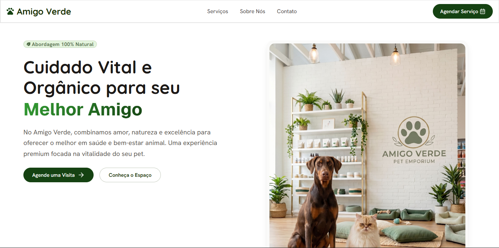
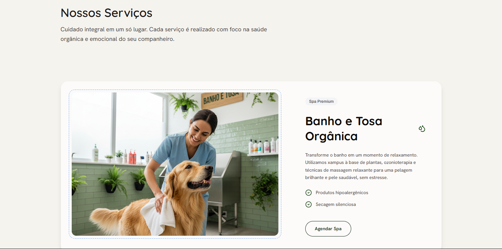
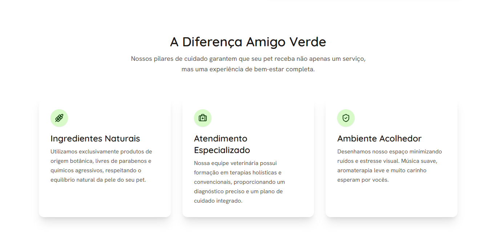

# 🌿 Amigo Pet

> 🚧 **Status do Projeto:** Em desenvolvimento 🚧

Amigo Pet é um projeto de desenvolvimento web de uma **Landing Page** focada no **nicho pet**.  
O objetivo do projeto foi criar uma plataforma que transmita uma experiência premium de cuidado animal, priorizando a vitalidade dos pets e combinando elementos de amor e natureza em sua identidade visual.

A aplicação atua como o cartão de visitas digital da marca, apresentando os serviços e o posicionamento do empreendimento de forma moderna e atraente.

---

## 🌐 Link do Projeto

🔗 Acesse a aplicação publicada: [Visitar Amigo Pet](https://amigo-verdepetshop.vercel.app)

---

## 📸 Preview do Projeto

### Home

##

### Serviços e Cuidados

### Diferencial Amigo Pet

---

## 🎯 Objetivo do Projeto

O intuito do Amigo Pet foi consolidar a presença digital da marca, onde o foco principal é:

- Apresentar os serviços premium de cuidado animal de forma clara
- Transmitir os valores da marca (amor, natureza e vitalidade) através do design
- Proporcionar uma navegação fluida e agradável para os tutores de pets

Além disso, o projeto teve como foco técnico a construção de uma interface com **animações suaves**, alta **responsividade** e estrutura semântica otimizada para **SEO**.

---

## ⚙️ Funcionalidades

- ✅ Interface 100% responsiva (Mobile First)
- ✅ Animações de transição e scroll
- ✅ Otimização de SEO e semântica web
- ✅ Design moderno e focado em UI/UX
- ✅ Apresentação de serviços e informações da marca
- ⏳ _Novas funcionalidades em desenvolvimento..._

---

## 🧠 Conceitos Trabalhados

Durante o desenvolvimento da Landing Page, foram aplicados diversos conceitos importantes do desenvolvimento front-end moderno, como:

- Componentização
- Estilização utilitária e responsividade com Tailwind CSS
- Animações de interface e microinterações com Framer Motion
- Boas práticas de acessibilidade e estruturação HTML
- Organização de layout para páginas de conversão

---

## 🛠️ Tecnologias Utilizadas

- **React**
- **Tailwind CSS**
- **Framer Motion**
- **Vite**

---
